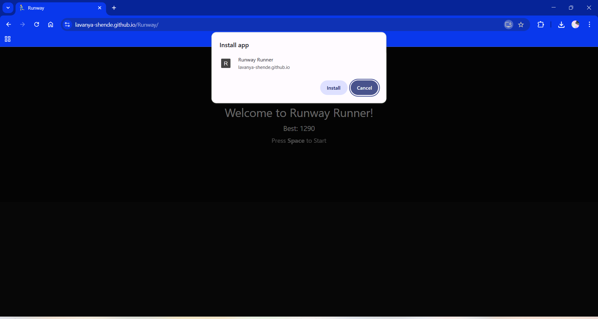
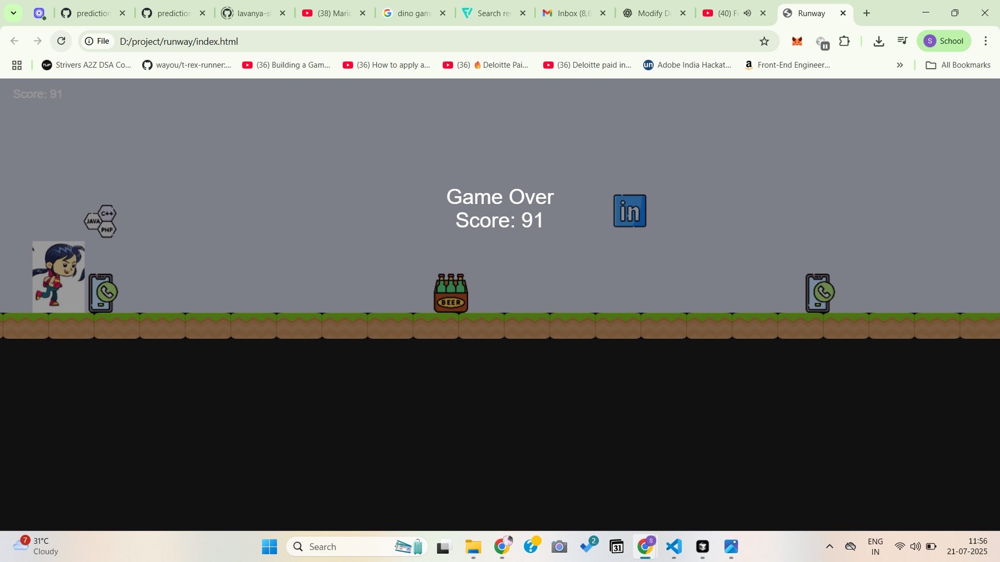
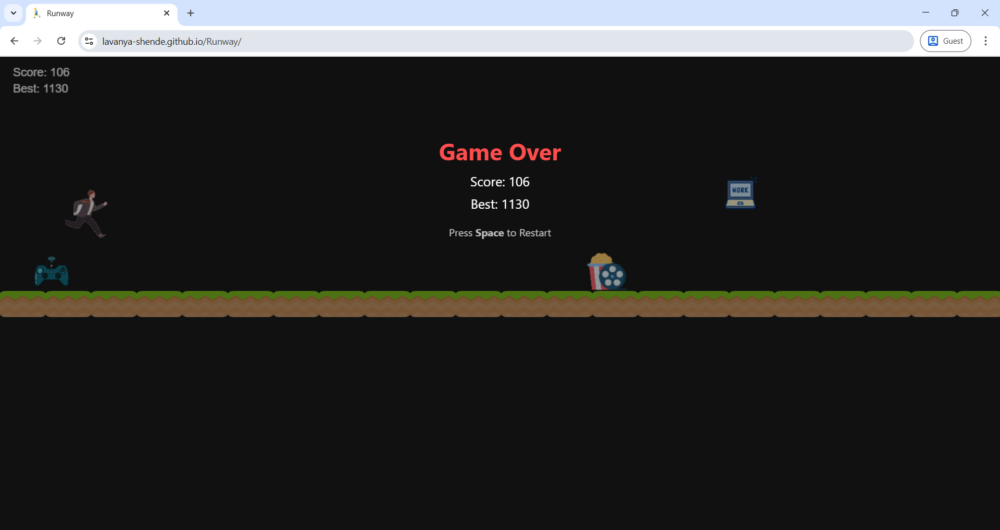

# 🎓 Runway Runner – A Student-Themed Endless Dino Game

**Runway Runner** is a fun, offline-friendly endless runner game inspired by the classic Chrome Dino game — but with a twist for students! Dodge distractions like social media and parties, and collect career-building items like resumes and certifications as you prepare for your dream job.

---

## 🕹️ Play the Game

👉 [**Live Demo**]https://lavanya-shende.github.io/Runway/  
*(PWA – works offline once loaded!)*

---

## 🚀 Features

- 🏃‍♀️ Smooth sprite animation with jump controls  
- 📈 Real-time score + persistent high score (stored locally)  
- 🎓 Student-themed obstacles & collectibles  
- ⬆️ Difficulty increases over time  
- 📴 Works offline using Service Workers (just like Dino game)  
- 📱 PWA-ready for mobile and desktop install

---

## 💻 Tech Stack

- HTML5 Canvas  
- Vanilla JavaScript  
- CSS  
- Service Worker API (for PWA support)

---

## 🧠 Concept

This game transforms the everyday struggles of a student into a playful and relatable game. Each collectible helps you move closer to your "dream job", while distractions like parties, games, and movies can knock you out.

---
